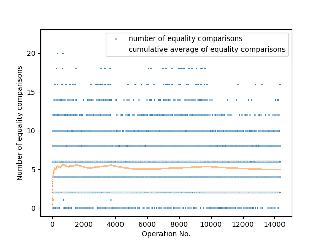
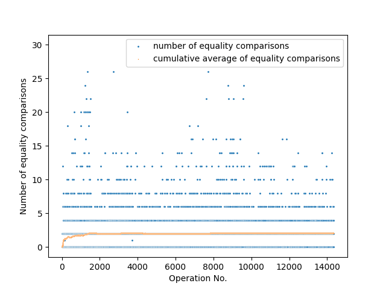

## Hash map

This project implements and compares two hash map implementation strategies in go  - separate chaining and the linear probing variant of open addressing.

The hash function used is the 32-bit variant of [FNV-1a](http://isthe.com/chongo/tech/comp/fnv/#FNV-1a) (Fowler-Noll-Vo) non-cryptographic hash function, which was chosen for its performance and ease of implementation.

The application for comparing the two implementations is `frequency_counter.go`, which counts the number of words exceeding a given length in the provided input text. The text used as input is _A Tale of Two Cities_ by Charles Dickens.

### Running the code

```sh
# run tests
$ go test -v

# build
$ go build

# linear probing 
$ ./hash-map-go -n=8 -impl=linear < tale.txt > out/tale_linear.csv

# chaining
$ ./hash-map-go -n=8 -impl=chain < tale.txt > out/tale_chain.csv
```

### Features
* Keys must be a string, but values can be of any type.
* Defines a common interface for all hash map implementations in `hash_map.go`.
* The desired capacity and load factor can be passed when initialising the hash map.
* To ensure good performance, both implementations dynamically resize by increasing table capacity and rehashing the entries if the load factor exceeds the desired threshold.

### Background

A **hash map**, also known as an associative array, is a data structure which maps keys to values. 

The basic insight behind a hash map is to map keys to a bucket via a hash function, and store the value in the corresponding bucket. This allows for more efficient key lookups, since one can search the bucket instead of scanning the entire table.

Since multiple keys can map to the same bucket (a **collision**), a collision resolutation strategy is required. Two of the most common strategies are separate chaining and open addressing.

In **separate chaining**, each bucket in the hash table points to a data structure which can hold multiple entries in case of collisions, e.g. a linked list.

In **open addressing** each bucket maps to a single entry in an array. In case of a collision, we look at the slot defined by a probe sequence. The simplest probe sequence is **linear probing**, which looks at the next entry in the array until until the desired key or an empty slot is found.

Performance for both separate chaining and open addressing suffers if the number of occupied entries relative to the number of buckets increases - this number is the **load factor**. The hash map can be rehashed to ensure the load factor stays within the desired bounds.

### Results

A key metric in comparing different hash maps is the *average number of equality comparisons per operation*, since this number must be low in order for the hash map to be efficient.

The figures below were generated by running `frequency_counter.go` on _A Tale of Two Cities_ to find the counts of all words with length greater than or equal to `8`.

For separate chaining with an initial capacity of `8` and desired load factor of `4`, the average number of equality comparisons is `4.97`. The spikes in the cumulative average of equality comparisons are evident, and occur each time the hash map resizes.



For linear probing with an initial capacity of `8` and desired load factor of `0.5`, the average number of equality comparisons is `2.09` comparisons.

The average number of equality comparisons used for linear probing is less than that of separate chaining.




### Further improvements

* See how the hash maps perform with a different hash function e.g. [djb2](http://www.partow.net/programming/hashfunctions/index.html#top)
* Add ability to delete a key, and resize the hash map to save space if load factor drops below a certain threshold.


### References

1. Sedgewick, W., & Wayne, K. (2014). _Algorithms Part I (4th Edition)_

2. Noll, L. _FNV Hash_. http://isthe.com/chongo/tech/comp/fnv/#FNV-1a